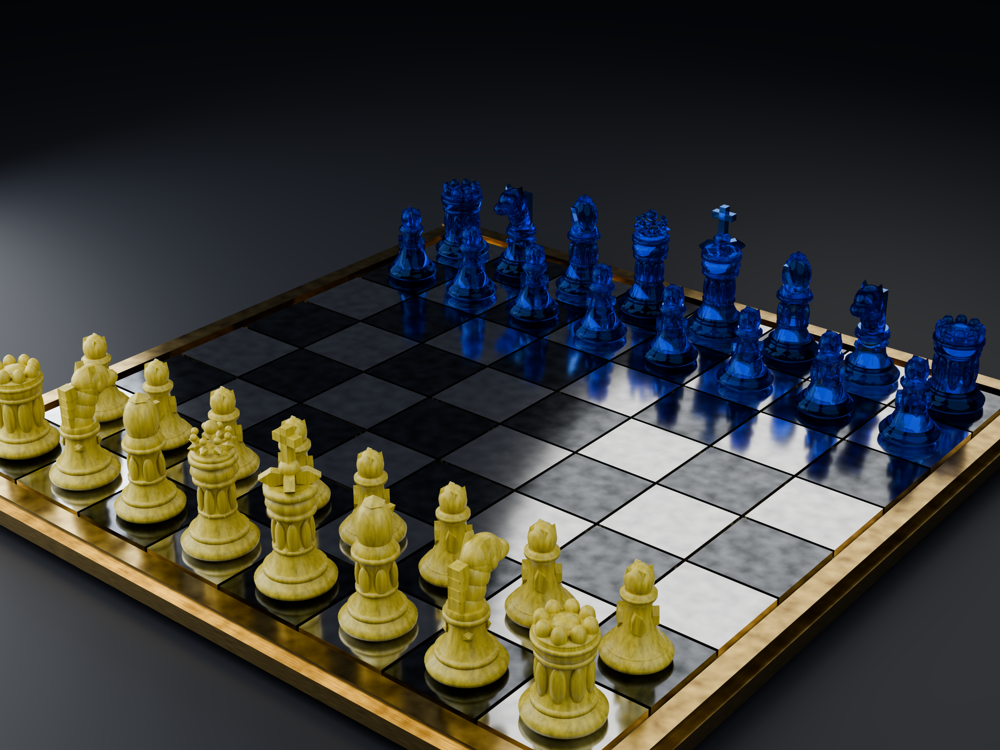

# Fantasy Chess Set Generator

Blender Extension version of the Fantasy Chess Set Generator.

## Features

- Elves, Samurai, and Dog & Cat chess-piece styles
- Wood, glass, metal, and stone piece materials
- Independent White and Black side colors
- Reflective board materials with joined or separately selectable checker geometry
- Chess-set render scene with material-aware lighting
- Full-set and individual-piece showcase workflows
- High-quality still-image and H.264 showcase render presets
- STL, glTF, and GLB export to the user's Downloads folder

## Install

Use Blender's **Extensions > Install from Disk** command and select the extension ZIP.
Disable or uninstall the legacy add-on build before enabling this extension to avoid duplicate registration.

## File permission

The extension declares Blender's `files` permission because export and video-render workflows write user-requested output to the Downloads folder.
